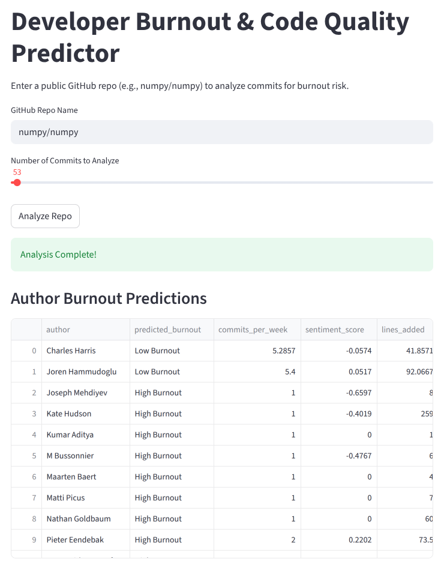
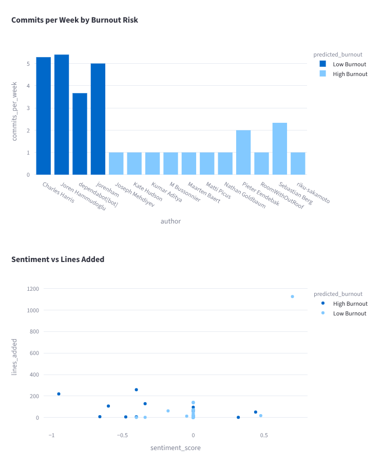
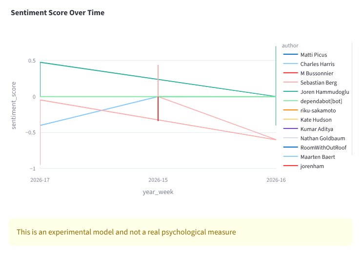

# Developer Burnout & Code Quality Predictor

This project analyzes GitHub commit activity to estimate **developer burnout risk** using simple patterns from real commit data.

It combines commit frequency, sentiment from commit messages, and code activity to give a basic idea of how “burned out” a developer might be all shown in a dashboard.

---

##  What this project does

* Fetches real commit data from GitHub (using API)
* Analyzes commit messages using sentiment analysis (VADER)
* Tracks weekly developer activity
* Predicts burnout level (**High / Low**) using a Random Forest model
* Displays results in a simple interactive dashboard

---

## Preview





---

## How it works

1. Collect commits from selected GitHub repositories
2. Extract features:

   * Commits per week
   * Sentiment score (from commit messages)
   * Lines of code added
3. Create burnout labels using simple rules
4. Train a Random Forest model
5. Use the model to predict burnout on new data


---

## Features

* Real GitHub repository analysis
* Sentiment analysis on commit messages
* Weekly activity tracking
* Machine learning-based burnout prediction
* Interactive charts using Plotly
* Commit-level insights

---

## Tech Stack

* Python
* PyGithub (for GitHub API)
* Pandas & NumPy
* NLTK (VADER Sentiment Analysis)
* Scikit learn (Random Forest)
* Streamlit
* Plotly
* uv

---

## Setup (using uv)

### 1. Install uv (if not installed)

```bash
pip install uv
```

### 2. Clone the repository

```bash
git clone https://github.com/Fluffy-debuger/dev-burnout-predictor.git
cd dev-burnout-predictor
```

### 3. Create environment & install dependencies

```bash
uv venv
uv pip install -r requirements.txt
```

### 4. Add environment variables

Create a `.env` file:

```env
PAT=your_github_personal_access_token
```

### 5. Run the app

```bash
uv run streamlit run app.py
```

---

## Example Insights

* High code additions + negative sentiment gives higher burnout risk
* Very low activity gives possible burnout
* Balanced activity + neutral sentiment gives lower burnout

---


## Limitations

* Burnout labels are rule-based
* Sentiment from commit messages may not reflect real emotions
* Limited features (no PR reviews, issue tracking, etc.)
* Model accuracy depends on collected data

---

## Future Improvements

* GitHub user-based analysis (not just repo)
* Time-based burnout tracking (trend over weeks)
* Better feature engineering
* Team-level insights
* Exportable reports

---

## Contributing & Support :

If you have ideas or want to improve this project, feel free to open an issue or submit a PR and if you found this project interesting or useful, consider giving it a star.

---
